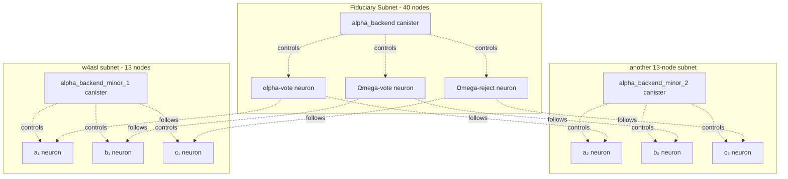

# ALPHA-Vote
Built on the [Internet Computer ∞](https://internetcomputer.org/) 


**ALPHA-Vote provides verifiably decentralised neuron automation.**

**[αlpha-vote](https://dashboard.internetcomputer.org/neuron/2947465672511369)**, **[Ωmega-vote](https://dashboard.internetcomputer.org/neuron/18363645821499695760)**, and **[Ωmega-reject](https://dashboard.internetcomputer.org/neuron/18422777432977120264)** are 3 known neurons that empower voters to get the most out of the [NNS](https://learn.internetcomputer.org/hc/en-us/articles/33692645961236-Overview), while ensuring that the NNS gets the best out of its voters. This voting framework (referred to collectively as ALPHA-Vote for simplicity) guarantees that your neuron votes, ensuring that voting rewards are never lost.

By following your choice of the above known neurons, your neuron can fall back to copying [D-QUORUM](https://dashboard.internetcomputer.org/neuron/4713806069430754115)'s vote (optionally asap or deferred within the last 3 hours of the proposal deadline). If [D-QUORUM](https://dashboard.internetcomputer.org/neuron/4713806069430754115) hasn't voted by then, a backstop mechanism ensures an automatic rejection vote. You can also choose to automatically reject within the last 3 hours, regardless of [D-QUORUM](https://dashboard.internetcomputer.org/neuron/4713806069430754115)'s vote.

#### [Ωmega-reject](https://dashboard.internetcomputer.org/neuron/18422777432977120264)
Voters who have every **intention** of reviewing proposals for a specific topic manually should consider following Ωmega-reject. In principle an automatic rejection should never occur, but in the unlikely event that a manual vote is accidentally missed, a rejection will be automatically triggered at the end of the voting period (as your neuron will follow the *last-minute* vote of Ωmega-reject).

<details>
<summary>Important Usage Notice</summary>

Ωmega-reject should ideally be the only neuron that you're following on a specific topic for this process to work reliably for that topic (otherwise consensus will be required, placing a dependency on the behaviour of those other neurons - ideally they'd also be following one of these 3 neurons to ensure reliability).

</details>

#### [Ωmega-vote](https://dashboard.internetcomputer.org/neuron/18363645821499695760)
Voters who intend to **sometimes** step in and vote on a specific topic should consider following Ωmega-vote. This ensures a diligent vote is cast by default (if D-QUORUM has voted), but also gives the follower the ability to vote manually for the vast majority of the voting period (should they decide to). If they end up not voting manually, D-QUORUM's vote will be copied by Ωmega-vote within the last 3 hours of the proposal deadline (which will then trigger your neuron to vote the same way). If D-QUORUM didn't vote either, then a default rejection will be triggered (in the same way as Ωmega-reject).

<details>
<summary>Important Usage Notice</summary>

Ωmega-vote should ideally be the only neuron that you're following on a specific topic for this process to work reliably for that topic (otherwise consensus will be required, placing a dependency on the behaviour of those other neurons - ideally they'd also be following one of these 3 neurons to ensure reliability).

</details>

#### [αlpha-vote](https://dashboard.internetcomputer.org/neuron/2947465672511369)
Voters who have no intention to review a proposal topic manually should consider following αlpha-vote (or another neuron who uses this framework by following one of these 3 neurons) to guarantee that voting opportunities are never missed, and that voting rewards are always captured. αlpha-vote basically follows D-QUORUM (so votes as soon as D-QUORUM votes), but will reject in the last 3 hours if D-QUORUM doesn't vote. The difference between αlpha-vote and Ωmega-vote is that the former votes as soon as it can, and the latter votes as late as it can (while still reliably ensuring a vote is cast). This difference in behaviour is where the alpha and omega naming convention comes from (first vs last).

<details>
<summary>Important Usage Notice</summary>

αlpha-vote should ideally be the only neuron that you're following on a specific topic for this process to work reliably for that topic (otherwise consensus will be required, placing a dependency on the behaviour of those other neurons - ideally they'd also be following one of these 3 neurons to ensure reliability).

</details>

-----

#### Why?

The above options allow diligent voters to take their time during reviews, safe in the knowledge that they will not accidentally miss the deadline in a way that leads to lost voting rewards. Followers commonly value knowing that their followee neuron will always vote, **no matter what**.

There are notable examples where diligent voters have lost followees simply for missing an occasional vote. This dynamic is not helpful for encouraging high quality due diligence and decentralisation. The above neurons solve this problem.

# Canisters

Canisters are Internet Computer smart contracts ([more info](https://internetcomputer.org/docs/building-apps/essentials/canisters)). ALPHA-Vote is composed of many canisters, providing redundancy and resilience as well as consensus and security:

- **[alpha_backend](https://dashboard.internetcomputer.org/canister/2lo52-kiaaa-aaaar-qaqta-cai)**
- **[alpha_backend_minor_1](https://dashboard.internetcomputer.org/canister/a2fbo-uiaaa-aaaac-qad2q-cai)/2/3/4/5** etc.
- **threshold** [...-cai](https://dashboard.internetcomputer.org/canister/) ([separate repo](https://github.com/aodl/threshold))

None of these canisters are controlled unilaterally by any person. They're decentralised, requiring team member consensus to manage and upgrade. Longer term, the plan is to further decentralise using tokenised governance, by launching an [SNS](https://learn.internetcomputer.org/hc/en-us/articles/34084394684564-SNS-Service-Nervous-System). 

More info about each canister is provided below. Jump further down in this document to read more about the threshold canister specifically.

<details>
<summary>alpha_backend</summary>

The alpha_backend canister (principal 2lo52-kiaaa-aaaar-qaqta-cai) is the verifiable controller of the [αlpha-vote](https://dashboard.internetcomputer.org/neuron/2947465672511369), [Ωmega-vote](https://dashboard.internetcomputer.org/neuron/18363645821499695760) and [Ωmega-reject](https://dashboard.internetcomputer.org/neuron/18422777432977120264) known neurons. This can be verified by querying the [NNS Governance Canister](https://dashboard.internetcomputer.org/canister/rrkah-fqaaa-aaaaa-aaaaq-cai)'s `list_neurons` method (specify `include_public_neurons_in_full_neurons` and the αlpha-vote neuron ID: 2947465672511369, or the Ωmega-vote neuron ID: 18363645821499695760, or the Ωmega-reject neuron ID: 18422777432977120264). The exact instructions are provided in more detail [here](https://forum.dfinity.org/t/known-neuron-proposal-d-quorum/37277) in relation to D-QUORUM.

At the time of deploying this suite of neurons, the IC has one high security subnet that's open for public deployment - the fiduciary subnet (currently 40 node machines participating in consensus). This is where the alpha_backend canister lives. In the unlikely event that the fiduciary subnet ever stalls and encounters a prolonged outage, it's essential that neuron votes continue to be triggered at the appropriate time. This redundancy is provided by the alpha_backend_minor_1/2/3/4/5 canisters.

</details>

<details>
<summary>alpha_backend_minor_1/2/3/4/5</summary>

Note that the full list of canisters in use at any one time can be found in [canister_ids.json](https://github.com/aodl/ALPHA-Vote/blob/master/canister_ids.json) (more canisters may be added in the future to improve resilience).

These canisters each reside on their own independent subnets. Given that the remaining subnets have lower consensus thresholds (13 nodes), consensus among these canisters (across subnets) is required to trigger a vote on **[αlpha-vote](https://dashboard.internetcomputer.org/neuron/2947465672511369)**, **[Ωmega-vote](https://dashboard.internetcomputer.org/neuron/18363645821499695760)**, and **[Ωmega-reject](https://dashboard.internetcomputer.org/neuron/18422777432977120264)**. This is achieved by each of these *minor* canisters being the controller of their own set of 3 neurons (these ones are not known neurons). Each canister affects their 3 neurons in the same way that the fiduciary alpha_backend canister affects the 3 known neurons.

The 3 known neurons are configured to follow the minor canister neurons on each topic. This means that >=50% of the minor canister neurons are required to vote the same way in order to trigger a vote on the corresponding known neuron.

The alpha_backend cansiter, and the alpha_backend_minor cansiters, poll the NNS at the same regular interval (offset arbitrarily by deployment timing and drift). They differ, however, in that the alpha_backend canister only triggers a vote on the known neurons in the last hour of the voting period (if the neuron hasn't voted already). The minor canisters, on the other hand, trigger a vote on their neurons as soon as 3 hours before the end of the voting period. This means that if all systems are working well, and the majority of subnets are not in a stalled state, then the fiduciary alpha_backend canister will never need to trigger a vote (it will have been triggered already via the followee neurons). If, on the other hand, consensus is not reached by those neurons (due to subnet failure), the alpha_backend canister will pick up the slack. 

Note that the majority of 13 node subnets involved in this consensus would need to be hijacked to be able to attack the known neurons and control their vote. Alternatively the fiduciary subnet would need to be hijacked (40 nodes makes this implausable under realistic assumptions). **Consensus across 13-node sunbets is a means of providing redundancy without sacrificing on security**.

</details>



### How to build and verify
Verify the build to be sure you are interacting with codebase that matches the release.
Pull the last release version.

`make release`

Verify it is the same build as here https://dashboard.internetcomputer.org/canister/...

**The backend canisters are controlled by the threshold canister**, which is what provides the decentralisation guarantee (that no individual member can exert unilateral control over the canisters, nor the neurons).

### How to deploy new minor canisters

Note that the following steps are tedious, but are not expected to need carrying out after initial bootstrapping (5 or so canisters are likely to be enough). These steps mostly serve as documentation that explains how the suite of canisters were created and configured.

These canisters are deployed via a two stage process:
1. Deploy **[alpha_backend_initial](https://github.com/aodl/ALPHA-Vote/tree/master/src/alpha_backend_initial)** as the initial implementation for any new canister. This is for creating and configuring the canister's 3 neurons.
2. Reinstall to the canister using the **[alpha_backend](https://github.com/aodl/ALPHA-Vote/tree/master/src/alpha_backend)** implementation. This is the implementation that actually makes use of those neurons with scheduled tasks.

There are also additional steps to follow after deployment, to ensure the newly created cansiter and neurons contribute to the overall suite of canisters.

<details>
<summary>Stage 1 (list of steps)</summary>

- First add a new entry to [dfx.json](https://github.com/aodl/ALPHA-Vote/blob/master/dfx.json), copying the one for `alpha_backend`, but rename to add `_minor_2` (but use whatever is the next available number, instead of 2), then also append `_initial` to the package name and the directories in the candid path (`src/alpha_backend_initial/alpha_backend_initial.did`) 
- Choose a subnet to deploy to (one that does not already contain an alpha_backend_minor canister)
- Deploy, using -> `dfx deploy alpha_backend_minor_{number} --network=ic --subnet {subnet_id}`
- Call `dfx canister id alpha_backend_minor_{number} --network=ic`. This should return the id of the new canister. It should match an entry that dfx will have automatically inserted into [canister_ids.json](https://github.com/aodl/ALPHA-Vote/blob/master/canister_ids.json) (this will need committing, to keep track of the suite of canisters being used).
- Get the default ICP account id for the canister using [canlista](https://k7gat-daaaa-aaaae-qaahq-cai.ic0.app/docs/)
- Transfer 3.0003 ICP to that account id (covering neuron staking and transfer fees for staking)
- Confirm the ICP was received by the canister by calling `dfx canister call alpha_backend_minor_{number} get_canister_icp_balance --network=ic`
- Having confirmed the canister's default account now has enough funds for neuron staking, create the 3 neurons by calling `dfx canister call alpha_backend_minor_{number} batch_create_neurons '(0:nat64, 3:nat64)' --network=ic`. This above command will create and configure the neurons with some basic settings (8 year staked, auto-stake maturity, and public visibility). The neuron ids should be returned in the response. The ids are also persisted in the logs. After creating the neurons, calling `dfx canister logs alpha_backend_minor_{number} --network=ic` should display output like the example below (except without the failure).

```
[0. 2025-05-05T11:19:46.772170351Z]: Neuron created with ID: 5174323877764575496
[1. 2025-05-05T11:19:46.772170351Z]: Created neuron 5174323877764575496 with nonce 0
[2. 2025-05-05T11:19:54.945741692Z]: Neuron created with ID: 12534430129395150681
[3. 2025-05-05T11:19:54.945741692Z]: Created neuron 12534430129395150681 with nonce 1
[4. 2025-05-05T11:19:57.481182159Z]: Failed at nonce 2: ICP transfer rejected: InsufficientFunds { balance: Nat(99980000) }
```

Note that these logs demonstrate a failure case (where an insufficient amont of ICP was transferred to the canister, causing creation to fail at the 3rd neuron). A failure such as this can be corrected easily (top up the ICP balance and call `create_neuron '(2:nat64)'` (2 being the nonce to use). If the batch creation hadn't failed, all 3 neurons would have been automatically configured after creation, but as this didn't happen in the scenario above, you would need to also call `configure_neuron '({neuron_id}:nat64)'` for each of the 3 neuron ids. Ultimately, what you're looking for is logs that look like this ->

```
[6. 2025-05-05T11:24:02.113907126Z]: Successfully set max dissolve delay for neuron 17332048203435221648
[7. 2025-05-05T11:24:05.841844011Z]: Successfully set auto-stake for neuron 17332048203435221648
[8. 2025-05-05T11:24:10.428460763Z]: Neuron 17332048203435221648 is now PUBLIC!
[9. 2025-05-05T11:25:16.796697133Z]: Successfully set max dissolve delay for neuron 5174323877764575496
[10. 2025-05-05T11:25:19.219053474Z]: Successfully set auto-stake for neuron 5174323877764575496
[11. 2025-05-05T11:25:22.077521063Z]: Neuron 5174323877764575496 is now PUBLIC!
[12. 2025-05-05T11:25:55.553562241Z]: Successfully set max dissolve delay for neuron 12534430129395150681
[13. 2025-05-05T11:26:01.705075704Z]: Successfully set auto-stake for neuron 12534430129395150681
[14. 2025-05-05T11:26:07.609042622Z]: Neuron 12534430129395150681 is now PUBLIC!
```

</details>

<details>
<summary>Stage 2 (list of steps)</summary>

- Once you've got this far, go back to [dfx.json](https://github.com/aodl/ALPHA-Vote/blob/master/dfx.json) and remove the _initial prefixs from the package and directories in the candid path. This means the `alpha_backend` implementation will now be used, rather than the `alpha_backend_initial` implementation.
- Then redeploy as a reinstall, specifying the neurons that were just created, and a 3 hour vote deadline threshold (10800 seconds). e.g.

```
dfx deploy alpha_backend_minor_{number} --argument='(record {
  alpha_vote_neuron_id              = 5174323877764575496;
  omega_vote_neuron_id              = 12534430129395150681;
  omega_reject_neuron_id            = 17332048203435221648;
  seconds_before_deadline_threshold = 10800
})' --mode=reinstall --network=ic
```

The neuron ids used in the command above should obviously be swapped for the ones created by the new canister (the neuron ids provided in the logs). As a convention, be sure to use the smallest neuron id for alpha_vote, the second smallest for omega_vote, and the largest for omega_reject.

- Check the logs after reinstalling (`dfx canister logs alpha_backend_minor_{number} --network=ic`). It's likely you'll see something like below if there are currently open proposals.

```
[15. 2025-05-05T11:31:18.664394441Z]: Reconfirmation triggered.
[16. 2025-05-05T11:31:21.208246017Z]: [P#136411] ERROR scanning ballot: Neuron 17332048203435221648 not found
[17. 2025-05-05T11:31:31.551263593Z]: [P#136411] ERROR scanning ballot: Neuron 12534430129395150681 not found
[18. 2025-05-05T11:31:35.325564374Z]: [P#136410] ERROR scanning ballot: Neuron 17332048203435221648 not found
[19. 2025-05-05T11:31:41.588513536Z]: [P#136410] ERROR scanning ballot: Neuron 12534430129395150681 not found
[20. 2025-05-05T11:31:45.131174638Z]: [P#136409] ERROR scanning ballot: Neuron 17332048203435221648 not found
[21. 2025-05-05T11:31:52.576601726Z]: [P#136409] ERROR scanning ballot: Neuron 12534430129395150681 not found
[22. 2025-05-05T11:31:55.44892825Z]: [P#136408] ERROR scanning ballot: Neuron 17332048203435221648 not found
[23. 2025-05-05T11:32:02.791420073Z]: [P#136408] ERROR scanning ballot: Neuron 12534430129395150681 not found
[24. 2025-05-05T11:32:06.098694392Z]: Cycles: 2944218093761, Proposals: 41 live,   of which  4 actionable,   of which  4 actioned,   of which  4 in this run. P#136412 due in 53872 seconds.
```

If you don't see the last line you may need to wait a minute and check the logs again. Regarding the errors, this is because the neurons were created while the proposals were open, so their ballots are not available. After 4 or so days, these errors will no longer occur.

- Set the alpha-vote neuron (smallest neuron id of the 3 for this new canister) to follow D-QUORUM directly. Note that the known alpha-vote neuron follows D-QOURUM indirectly, via these minor canister neurons (see post-deployment configuration).

```
dfx canister call alpha_backend_minor_[n] follow '([smallest id of this canister's 3 neurons]:nat64, 0:int32, vec { 4713806069430754115:nat64 })' --network=ic
dfx canister call alpha_backend_minor_[n] follow '([smallest id of this canister's 3 neurons]:nat64, 4:int32, vec { 4713806069430754115:nat64 })' --network=ic
dfx canister call alpha_backend_minor_[n] follow '([smallest id of this canister's 3 neurons]:nat64, 14:int32, vec { 4713806069430754115:nat64 })' --network=ic
```

</details>

<details>
<summary>Post-deployment Configuration (list of steps)</summary>

Ideally it is best to wait for the errors above to resolve before carrying out the following steps.

Now we need to set the main alpha_backend canister neurons (the **known neurons**) to follow the votes of the neurons of this new canister (in addition to all the other pre-existing minor canister neurons). You therefore need to be careful to check the current configuration, and then append the new neuron ids to the followees list for each of the 3 known neurons.

This change will need to go through consensus and team member voting. Once the proposals pass, the new canister (and neurons) will become productive participants in the suite of canisters/neurons.

**TODO adjust this section once the threshold canister setup has been finished.**

<details>
<summary>Configuring αlpha-vote</summary>

The following dfx commands configure the **[αlpha-vote](https://dashboard.internetcomputer.org/neuron/2947465672511369)** known neuron to follow specific neurons on all necessary topics (0 - Unspecified, 4 - Governance, 14 - SNS & Neurons Fund). Note that the vec needs filling in with all existing followee neurons, in addition to the new one (the smallest id of the 3 neurons just created). You can confirm the current followee setup by querying the NNS Governance cansiter.

```
dfx canister call alpha_backend follow '(2947465672511369:nat64, 0:int32, vec { ... })' --network=ic
dfx canister call alpha_backend follow '(2947465672511369:nat64, 4:int32, vec { ... })' --network=ic
dfx canister call alpha_backend follow '(2947465672511369:nat64, 14:int32, vec { ... })' --network=ic
```

</details>

<details>
<summary>Configuring Ωmega-vote</summary>

The following dfx commands configure the **[Ωmega-vote](https://dashboard.internetcomputer.org/neuron/18363645821499695760)** known neuron to follow specific neurons on all necessary topics (0 - Unspecified, 4 - Governance, 14 - SNS & Neurons Fund). Note that the vec needs filling in with all existing followee neurons, in addition to the new one (the second smallest id of the 3 neurons just created). You can confirm the current followee setup by querying the NNS Governance cansiter.

```
dfx canister call alpha_backend follow '(18363645821499695760:nat64, 0:int32, vec { ... })' --network=ic
dfx canister call alpha_backend follow '(18363645821499695760:nat64, 4:int32, vec { ... })' --network=ic
dfx canister call alpha_backend follow '(18363645821499695760:nat64, 14:int32, vec { ... })' --network=ic
```

</details>

<details>
<summary>Configuring Ωmega-reject</summary>

The following dfx commands configure the **[Ωmega-reject](https://dashboard.internetcomputer.org/neuron/18422777432977120264)** known neuron to follow specific neurons on all necessary topics (0 - Unspecified, 4 - Governance, 14 - SNS & Neurons Fund). Note that the vec needs filling in with all existing followee neurons, in addition to the new one (the largest id of the 3 neurons just created). You can confirm the current followee setup by querying the NNS Governance cansiter.

```
dfx canister call alpha_backend follow '(18422777432977120264:nat64, 0:int32, vec { ... })' --network=ic
dfx canister call alpha_backend follow '(18422777432977120264:nat64, 4:int32, vec { ... })' --network=ic
dfx canister call alpha_backend follow '(18422777432977120264:nat64, 14:int32, vec { ... })' --network=ic
```

</details>


</details>

Finally, be sure to set log visibility to public.
- `dfx canister update-settings alpha_backend_minor_{number} --log-visibility=public --network=ic`

### Maintenance

#### Testing

#### Logs

~~All canister logs are private and visible only to team members (see the Settings section at the end of this document). The reason for this is to reduce the surface for cycle draining attacks. Similarly, different team members are responsible for accessing the logs of different canisters (no team members has direct access to the logs for all canisters).~~ All logs are public, [without the need to worry about a cycle drain attack](https://forum.dfinity.org/t/canister-logging-support-community-consideration/25571/45).

#### Cycles

The cycles balance for each canister is provided in the scheduled log entries. This helps with establishing the rate that cycles are being depleted. Here's an example of what normal logs look like for one of the minor canisters:

```
...
[1394. 2025-06-01T03:33:42.370973756Z]: Cycles: 2821409555036, Proposals: 41 live,   of which  0 actionable,   of which  0 actioned,   of which  0 in this run. P#136762 due in 1617 seconds.
[1395. 2025-06-01T04:34:05.161367974Z]: Cycles: 2821190936841, Proposals: 41 live,   of which  3 actionable,   of which  3 actioned,   of which  3 in this run. P#136765 due in 5206 seconds.
[1396. 2025-06-01T05:33:39.092400623Z]: Cycles: 2821088402752, Proposals: 41 live,   of which  3 actionable,   of which  3 actioned,   of which  0 in this run. P#136765 due in 1609 seconds.
[1397. 2025-06-01T06:33:53.016396817Z]: Cycles: 2820901073728, Proposals: 41 live,   of which  5 actionable,   of which  5 actioned,   of which  2 in this run. P#136767 due in 5225 seconds.
[1398. 2025-06-01T07:33:39.728128677Z]: Cycles: 2820798462487, Proposals: 41 live,   of which  5 actionable,   of which  5 actioned,   of which  0 in this run. P#136767 due in 1625 seconds.
[1399. 2025-06-01T08:33:57.275413622Z]: Cycles: 2820579897149, Proposals: 41 live,   of which  8 actionable,   of which  8 actioned,   of which  3 in this run. P#136770 due in 5222 seconds.
[1400. 2025-06-01T09:33:41.311096619Z]: Cycles: 2820477314296, Proposals: 41 live,   of which  8 actionable,   of which  8 actioned,   of which  0 in this run. P#136770 due in 1620 seconds.
[1401. 2025-06-01T10:33:59.85278223Z]: Cycles: 2820258723182, Proposals: 41 live,   of which 11 actionable,   of which 11 actioned,   of which  3 in this run. P#136773 due in 62821 seconds.
...
```

For the time-being team members are responsible for monitoring and topping up when needed. Longer-term, a sister-project will remove the need for cycle monitoring (using reward-generating assets to source a perpetual supply of cycles). 

## Threshold Canister

This canister is set as the exclusive controller of all of the other canisters described above. The **threshold canister** is also set as it's own controller (facilitating self-upgrade proposals).

The threshold canister is what allows the other canisters to be managed in a decentralised manner, requiring a vote from team members in order to upgrade the canisters.

Although self-upgrades are supported, if an upgrade of the threshold canister is ever needed, the plan would be to initialise a second threshold canister with the same configuration (as a fallback). Threshold canister A would then need to assign joint control to threshold canister B (an operation that would require a proposal and consensus). This would act as a safety measure, allowing recovery from botched threshold canister upgrades (just in case).

### Verify threshold build
Verify build to be sure you are interacting with codebase that matches the release.
Pull the last release version.

dfx deploy threshold --with-cycles 80000000000 --argument='(vec {principal "'$(dfx identity get-principal)'"; principal "2vxsx-fae"; })'

shasum -a 256 .dfx/local/canisters/threshold/threshold.wasm 

Verify it is same build as here https://dashboard.internetcomputer.org/canister/...

# Settings

The majority of canister settings are using the default values. There are a few that have been explicitly set, described below.

- `log-visibility=public`
- `controllers`
  - alpha_backend (all): `...`
  - threshold: `...`, `...`

